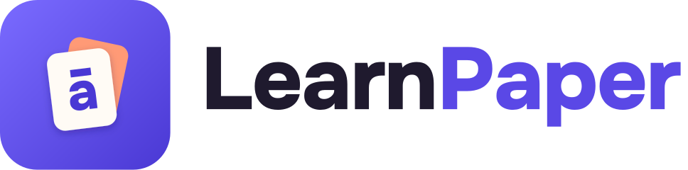

<p align="center"></p>

**LearnPaper** turns your phone's wallpaper into a vocabulary flashcard. Every hour (or on the schedule
you choose) a new card appears: a word, how to say it, its translations and a short example — in English,
Russian and Tajik, in any direction. The interface is Tajik by default, with Russian and English one tap
away.

- **2,433 words across all six CEFR levels** — A1 490 · A2 382 · B1 517 · B2 538 · C1 292 · C2 214 —
  bundled in the app, fully offline. Every Tajik word and example was checked against the Rahimi–Uspenskaya
  dictionary, Wiktionary and a 564k-sentence Tajik corpus (there is no native reviewer on the project).
- **Android** (Kotlin, Jetpack Compose): the card is the wallpaper itself, redrawn in place — a new word
  never re-themes the phone or reloads the home screen, and nothing runs while the screen is off. Words
  change on your schedule (1 minute to 24 hours), a home-screen widget with a next-word button, word
  library with search in any language, light spaced repetition, streaks, daily notification, lock-screen
  layouts for both small-top and large centred clocks, light and dark themes, twenty card palettes (ten
  light, ten dark). Works from Android 8.0.
- **iOS** (Swift, SwiftUI, iOS 17): widgets and a Shortcuts-based wallpaper flow (iOS does not let apps
  set the wallpaper) — ported but not yet compiled; see `ios/README.md`.

| | |
|---|---|
| `android/` | The Android app. `./gradlew :app:assembleRelease` (signed with `android/keystore.properties`) |
| `ios/` | The iOS app (XcodeGen `project.yml`) |
| `content/` | Word list (`source/words.jsonl`), build script, and the checking tools (`tools/`) |
| `branding/` | Logo, icon, colours and fonts — all generated by `make_brand.py` |
| `docs/` | Design document, release guide |

```bash
python3 -m venv content/.venv && content/.venv/bin/pip install pillow   # once
python3 content/scripts/build.py          # words + images → app assets
cd android && ./gradlew :app:installDebug  # run on a device or emulator
```

Guidance for contributors and AI assistants: `CLAUDE.md`. Design and decisions: `docs/DESIGN.md`.
Releasing: `docs/RELEASE.md`. Brand: `branding/README.md`. Content tools: `content/tools/README.md`.

Credits: word levels from the CEFR-J Wordlist (Tono Laboratory, TUFS) and the Octanove C1/C2 profile;
illustrations from Microsoft's Fluent Emoji (MIT); fonts Onest and Inter (SIL OFL 1.1); Tajik corpus from
the Leipzig Corpora Collection; dictionary lookups via sahifa.tj; Russian stress data from OpenRussian.
